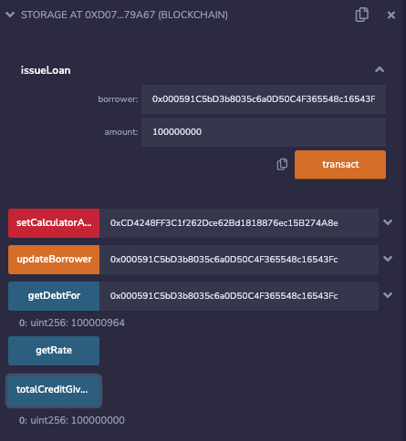

# Calculate Compound Interests in Solidity

### Context
Calculate the loan with a compounded interest rate through two simple contracts that interact with each other.

The contract `CalculateInterest.sol` controls the interest rate and does that calculations while the other contract `Storage.sol` keeps track of the loans and total outstanding debt.

### MVP Flow

Deploy `CalculateInterest.sol` and obtain the contract address. Now deploy `Storage.sol` and call `setCalculatorAddr(address _addr)` to connect it to the first contract. It is now possible to issue loans with `issueLoan(address borrower, uint amount)`. Make sure the data is periodically updated.

### Ropsten Deployment

The calculator contract status: [etherscan](https://ropsten.etherscan.io/address/0x1b81879db985e84229e1660f408ab0c612ef733d)

The storage contract status: [etherscan](https://ropsten.etherscan.io/address/0xf1cb60c75082ead3223b99fedee7402f9d54f00b)

Interest accrues on a debt:

### Testing

This project uses [Truffle](https://trufflesuite.com/) and [ganache](https://github.com/trufflesuite/ganache/).

Tests can be run by starting a `ganache` instance (mock server) and then calling `truffle test`.

### Dependencies

Nothing spicy, only the ones needed for a basic project.
