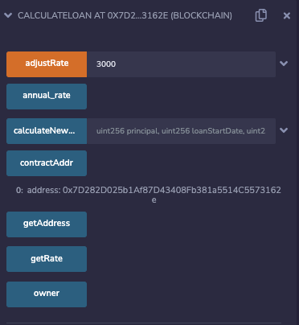

# Calculate Compound Interests in Solidity

### Context
Calculate the loan with a compounded interest rate through two simple contracts that interact with each other.

The contract `CalculateLoan.sol` controls the interest rate and calculates a debt while the other contract `Storage.sol` keeps track of the loans and total outstanding debt.

### MVP Flow

Deploy `CalculateLoan.sol` and obtain the contract address. Now deploy `Storage.sol` and call `setCalculatorAddr(address _addr)` to connect it to the first contract. It is now possible to issue loans with `issueLoan(address borrower, uint amount)`. Make sure the data is periodically updated.

### Ropsten Deployment

The calculator contract on etherscan: [0x7d282d02](https://ropsten.etherscan.io/address/0x7d282d025b1af87d43408fb381a5514c5573162e)

Set the rate of the live contract to 30%:

The storage contract on etherscan: [0x70952ac6](https://ropsten.etherscan.io/address/0x70952ac60b4d4ea21b8c4c770ce2c170861a9b62)

An hour later, the storage records a change in debt:

### Testing

This project uses [Truffle](https://trufflesuite.com/) and [ganache](https://github.com/trufflesuite/ganache/).

Tests can be run by starting a `ganache` instance (mock server) and then calling `truffle test`.

### Dependencies

Nothing spicy, only the ones needed for a basic project.
